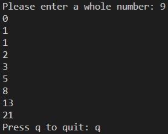

# Fib Generator

This simple script displays the numbers found in the Fibonacci sequence using Python's generator data type. It asks the user to enter a number, and then it begins to display that many numbers from the Fibonacci sequence.

Make sure [Python](https://www.python.org/downloads/ "Download Python from www.python.org") is installed on your device before opening this file.

## Credits

Alex Akoopie - Creator

Soham Ratnaparkhi - Debugged inefficient algorithm